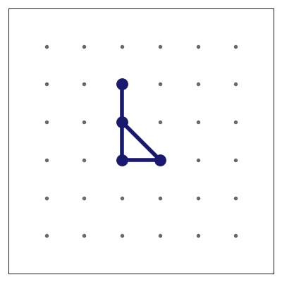
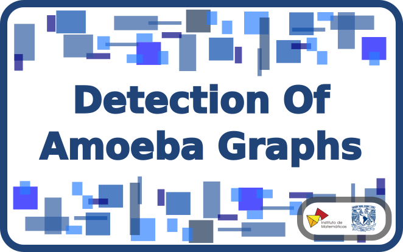
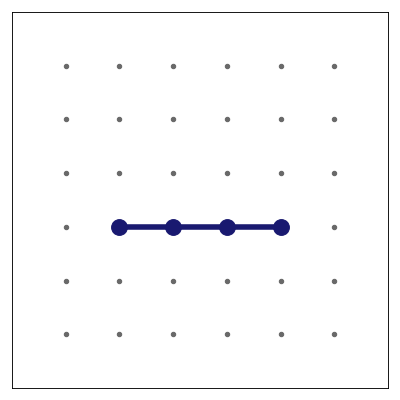

# Welcome to the Repo

## Developed by

- Mtr. Marcos E. González Laffitte 
  IMATE - UNAM Campus Juriquilla, México. 
  marcoslaffitte@gmail.com
  
- Dra. Amanda Montejano Cantoral 
  UMDI - Facultad de Ciencias - UNAM Campus Juriquila, México 
  amandamontejano@ciencias.unam.mx

## About

Amoebas are a family of simple graphs first defined by Adriana Hansberg, Yair Caro and Amanda Montejano, who initially studied them in the context of Ramsey-Turán Theory [1, 2]. The study of these graphs is of interest, in particular, due to its relation with the graph isomorphism problem. All the programs here can be used to detect amoebas and analyze their properties. This repository was developed as part of the work of Marcos E. González Laffitte's Master Thesis in Mathematics [3] under supervision of Dra. Amanda Montejano Cantoral. 

## Description

   Here we provide two different implementations of the same algorithm. If you wish to analyze only one graph, you can make use of the script Amoebas_Standalone.py in this repository. You can find the instructions on how to use this below. On the other hand, if you want to analyze a big batch of graphs you would need to use the scripts in the other folders. For instructions on this keep reading this section.

All the directories / folders numbered from 1 to 5 contain each two Python scripts that can be used to detect and analyze different properties of amoebas, as shown in the Instruction_Manual.pdf included in this repository (please find below a direct link to it). On the other hand, the folder 6_Examples contains the results of three different analyses: one over the set of graphs named Thesis_Examples.g6, other over the set of all non-isomorphic graphs having from 1 and up to 7 vertices, and finally a collection of the results obtained for bigger sets of graphs, specifically over all the non-isomorphic graphs having from 1 and up to 10 vertices, as well as over all the non-isomorphic trees having from 1 and up to 22 vertices. Please take into account that some of these last pdf files are large, and therefore should be downloaded in order to be visualized properly. 

> Please find <a href="./Instruction_Manual.pdf">here</a> the detailed instruction manual for the programs in this repo. 

## Instructions for the Stand-alone script

## References

#### Literature

[1] Yair Caro, Adriana Hansberg, Amanda Montejano, "Graphs isomorphisms under edge-replacements and the family of amoebas", p. 33, 2021. 
https://doi.org/10.48550/arXiv.2007.11769

[2] Yair Caro, Adriana Hansberg, Amanda Montejano, "Unavoidable chromatic patterns in 2-colorings of the complete graph". Journal of Graph Theory, 2021, vol. 97, pages 123-147. 
https://onlinelibrary.wiley.com/doi/abs/10.1002/jgt.22645

[3] Marcos Emmanuel González Laffitte, Tesis de Maestría en Ciencias Matemáticas, UNAM, "Estudio de Amoebas y sus Propiedades: Detección Computacional de esta Familia de Gráficas y el Caso de los Reemplazos Raros", p. 111, 2022. Complete text Available in Spanish at:  
http://132.248.9.195/ptd2022/septiembre/0831065/Index.html

#### Used Database of Graphs and Trees - Last visited on: June 10th, 2022

[4] Main page: Combinatorial Data - Prof. Brendan D. McKay, School of Computing, Australian National University. 
https://users.cecs.anu.edu.au/~bdm/data/

[5] Simple Graphs having from 1 and up to 10 vertices were obtained from: Graphs Page - Prof. Brendan D. McKay, School of Computing, Australian National University. 
https://users.cecs.anu.edu.au/~bdm/data/graphs.html

[6] Trees having from 1 and up to 22 vertices were obtained from: Trees Page - Prof. Brendan D. McKay, School of Computing, Australian National University. 
https://users.cecs.anu.edu.au/~bdm/data/trees.html

[7] Definition of graph6 encoding - Prof. Brendan D. McKay, School of Computing, Australian National University. 
https://users.cecs.anu.edu.au/~bdm/data/formats.txt